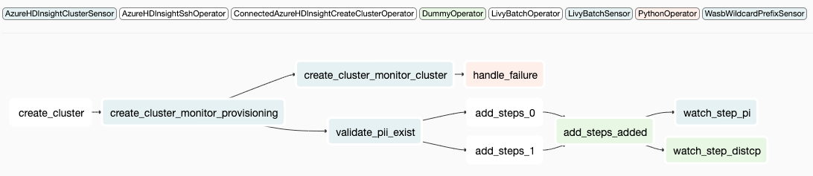

Ditto
=====

Ditto is a framework which allows you to do transformations to an Airflow DAG, to convert it into another DAG which is flow-isomorphic with the original DAG. i.e. it will orchestrate a flow of operators which yields the same results, but was just transformed to run in another environment or platform. The framework was built to transform EMR DAGs to run on Azure HDInsight, but you can extend the rich API for any other kind of transformation. In fact you can transform DAGs such that the result is not isomorphic too if you want (although at that point you're better off writing a whole new DAG).

The purpose of the framework is to allow you to maintain one codebase and be able to run your airflow DAGs on different execution environments (e.g. on different clouds, or even different container frameworks - spark on YARN vs kubernetes). It is not meant for a one-time transformation, but for continuous and parallel DAG deployments, although you can use it for that purpose too.

At the heart, Ditto is a graph manipulation library, which extendable APIs for the actual transformation logic. It does come with out of the box support for EMR to HDInsight transformation though.

The reason behind creation of Ditto at Trufactor is well documented `here <https://inmobi-my.sharepoint.com/:w:/r/personal/angad_singh_inmobi_com/_layouts/15/Doc.aspx?sourcedoc=%7B8FA897AD-82BC-5054-B2A0-AB2910B58CA8%7D&file=Proposal_%20Airflow%20operator%20abstraction%20for%20a%20multi-cloud%20environment.docx&action=default&mobileredirect=true&cid=2df10ccd-f32c-4a15-95e3-9b52a2c5b03d>`_

TOC
~~~

* :ref:`Examples <a-quick-example>`
* :ref:`Concepts <concepts>`

  * :ref:`Transformers <transformers>`
  * :ref:`Resolvers <resolvers>`
  * :ref:`SubDag Transformers and Matchers <subdag-transformers-and-matchers>`
  * :ref:`Templates <templates>`

* :ref:`Built-in implementations <built-in-implementations>`

.. _a-quick-example:

A quick example
~~~~~~~~~~~~~~~

Ditto is created for conveniently transforming a large number of DAGs which follow a similar pattern quickly. Here's how easy it is to use Ditto:

.. code-block:: python

   ditto = ditto.AirflowDagTransformer(DAG(
       dag_id='transformed_dag',
       default_args=DEFAULT_DAG_ARGS
   ), transformer_resolvers=[
       ClassTransformerResolver(
           {SlackAPIOperator: TestTransformer1,
            S3CopyObjectOperator: TestTransformer2,
            BranchPythonOperator: TestTransformer3,
            PythonOperator: TestTransformer4}
       )])

   new_dag = ditto.transform(original_dag)

You can put the above call in any python file which is visible to airflow and the resultant dag loads up thanks to how airflow's dagbag finds DAGs.

*Source DAG* *(airflow view)*

*Transformed DAG*

A more complex example
~~~~~~~~~~~~~~~~~~~~~~

This is how you can transform any EMR operator based DAG to an HDInsight operator based DAG (using operators from the `airflow-hdinsight <https://gitlab.pinsightmedia.com/telco-dmp/airflow-hdinsight>`_ project)

.. code-block:: python

   ditto = ditto.AirflowDagTransformer(DAG(
       dag_id='HDI_dag',
       default_args=DEFAULT_DAG_ARGS,
       dagrun_timeout=timedelta(hours=2),
       max_active_runs=1,
       schedule_interval=None,
       ),
       transformer_resolvers=[
           AncestralClassTransformerResolver({
               EmrCreateJobFlowOperator: EmrCreateJobFlowOperatorTransformer,
               EmrJobFlowSensor: EmrJobFlowSensorTransformer,
               EmrAddStepsOperator: EmrAddStepsOperatorTransformer,
               EmrStepSensor: EmrStepSensorTransformer,
               EmrTerminateJobFlowOperator: EmrTerminateJobFlowOperatorTransformer,
               S3KeySensor: S3KeySensorBlobOperatorTransformer
           })],
       transformer_defaults=TransformerDefaultsConf({
           EmrCreateJobFlowOperatorTransformer: TransformerDefaults(
               default_operator=create_cluster_op
           ),
           CheckClusterSubDagTransformer: TransformerDefaults(
               default_operator=create_cluster_op)}),
       subdag_transformers=[CheckClusterSubDagTransformer],
       debug_mode=True)

   new_dag = ditto.transform(original_dag)

There's a lot happening here, but the above example uses (almost) all capabilities of the Ditto API. It finds source operators using a :class:`resolver <ditto.api.TransformerResolver>` which specifies it's :class:`transformers <ditto.api.OperatorTransformer>`\ , it takes :obj:`default operators <ditto.api.TransformerDefaults.default_operator>`\ , transforms operators and replaces them with new sub-DAG of operators, uses a :class:`~ditto.api.SubDagTransformer` to transform and replaces entire sub-DAG of operators, where the sub-DAGs to be found are found using :class:`matchers <ditto.api.TaskMatcher>` and so on. The above DAG transformation logic is provided out of the box as a :mod:`template <ditto.templates>`\ : :class:`~ditto.templates.EmrHdiDagTransformerTemplate`

*Source DAG* *(rendered by ditto)*

.. image:: README.assets/complex_dag_emr.png
   :target: README.assets/complex_dag_emr.png
   :alt: Figure_1

*Transformed DAG*

.. _concepts:

Concepts
^^^^^^^^

.. _transformers:

Transformers
~~~~~~~~~~~~

At the bottom of the abstraction hierarchy of Ditto's API are ``Transformers``.  These are the basic nuts and bolts of the system. These are called from Ditto's core during a transformation to convert the source DAG's operators to the target DAG's operators. There are two types of `Transformers`: `OperatorTransformer` and `SubDagTransformer`. We'll talk about the former first, as the latter requires munching up a few more concepts to understand. An example `OperatorTransformer` could look like this:

.. code-block:: python

   class IAmABasicTransformer(OperatorTransformer):
       def transform(self, src_operator: BaseOperator, parent_fragment: DAGFragment,
                     upstream_fragments: List[DAGFragment]) -> DAGFragment:
           op = LivyBatchSensor(
               batch_id="foo",
               task_id=src_operator.task_id,
               azure_conn_id="foo",
               cluster_name="foo",
               verify_in="yarn",
               dag=self.dag
           )
           return DAGFragment([op])

As you can see, it can access the ``src_operator``\ , choose to copy its fields or do whatever it pleases with it in order to create the target operator. ``Transformers`` return ``DAGFragments``\ , which represents an intermediate sub-DAG of the target DAG you're trying to create. ``DAGFragments`` can contain one or an entire sub-DAG of operators, and are linked to each other in a graph structure.

Here's an example of an ``OperatorTransformer`` which returns a transformed sub-DAG:

.. code-block:: python

   class IAmASlightlyMoreComplexTransformer(OperatorTransformer):
       def transform(self, src_operator: BaseOperator, parent_fragment: DAGFragment,
                     upstream_fragments: List[DAGFragment]) -> DAGFragment:
           tp1 = LivyBatchSensor(
               batch_id="foo",
               task_id = "t2p1",
               azure_conn_id="foo",
               cluster_name=src_operator.dest_bucket_key,
               verify_in="yarn",
               dag=self.dag
           )

           tp2 = DummyOperator(task_id='t2p2', dag=self.dag)
           tp3 = DummyOperator(task_id='t2p3', dag=self.dag)
           tp4 = DummyOperator(task_id='t2p4', dag=self.dag)
           tp5 = PythonOperator(task_id='t2p5', python_callable=print, dag=self.dag)

           tp1 >> [tp2, tp3] >> tp4

           return DAGFragment([tp1, tp5])

As you can see this returns an entire sub-DAG instead of just one target operator. This ``DAGFragment`` will replace the ``src_operator``\ , at its position in the source DAG, in the target DAG returned by Ditto.

*About ``parent_fragment`` and ``upstream_fragments``\ :*

``Transformers`` sometimes need access to transformations of previous upstream transformers. E.g. you created the cluster, but now the add-steps operator needs to know the cluster name or ID, or your step-sensor needs to know the job ID from add-steps. ``parent_fragment`` is the ``DAGFragment`` of the parent op in the source DAG. You can traverse it using ``TransformerUtils.find_op_in_fragment_list`` or a whole bunch of other utility methods to find a matching parent previously transformed. Similarly, ``upstream_fragment`` contains *all* the upstream transformed tasks. Think of it as a level-order/BFS traversal, uptil this task, in the target DAG *transformed so far*.

This is a core part of how Ditto works: it allows transformers to *talk to each other* while tranforming a DAG. Look at the ``EmrStepSensorTransformer`` or ``EmrAddStepsOperatorTransformer`` to see how this works.

.. _resolvers:

Resolvers
~~~~~~~~~

Ok, so you made a bunch of cool transformers. But how would Ditto know which one to use for which source operator? That's where ``Resolvers`` come in. As you can see in the examples given at the beginning, when you initialize ditto's core (\ ``ditto.AirflowDagTransformer``\ ), you give it a bunch of resolvers to use. When traversing the source graph, it asks each resolvers to *resolve a transformer for that source task*. It then uses that ``Transformer`` to transform that source task. Ditto provides the following ``Resolvers`` out of the box, but you can write your own:

* ``ClassTransformerResolver``\ : find transformer based on source task's python class
* ``AncestralClassTransformerResolver``\ : find transformer based on all the ancestor classes of the source task's python class
* ``PythonCallTransformerResolver``\ : match a transformer with an operator if its a ``PythonOperator`` and it's ``python_callable`` is calling a specified python method inside. It uses runtime source code parsing to achieve this. This comes handy when you want to transform custom ``PythonOperator``\ s or ``BranchPythonOperator``\ s in the source DAG and match on them.

.. _subdag-transformers-and-matchers:

SubDag Transformers and Matchers
~~~~~~~~~~~~~~~~~~~~~~~~~~~~~~~~

This is where Ditto gets serious, if it did not appear so already. Suppose you want to transform entire sub-DAGs of the source DAG and replace them with your own subgraph of operators, and not just match on individual tasks. This is where ``SubDagTransformer``\ s come in. This is best explained with an example

.. image:: README.assets/check_cluster_emr_dag.png
   :target: README.assets/check_cluster_emr_dag.png
   :alt: check_cluster_emr_dag

In this DAG, there's a pattern we want to match and replace:

.. code-block:: python

   check_for_emr_cluster_op >> [create_cluster_op, cluster_exists_op]
   create_cluster_op >> get_cluster_id_op
   cluster_exists_op >> get_cluster_id_op

The DAG first checks if an EMR cluster exists, creates one if it doesn't and then with getting the cluster ID for downstream tasks. If we wanted to convert this to an HDInsight DAG, we wouldn't need this shebang, because ``AzureHDInsightCreateClusterOperator`` is idempotent, in that it simply does all of the above inside the operator itself (not explicitly, due to the nature of the HDInsight management API simply ignoring the create call if the cluster already exists). So we can cook up the following ``SubDagTransformer`` to solve this problem:

.. code-block:: python

   class CheckClusterSubDagTransformer(SubDagTransformer):
       def get_sub_dag_matcher(self) -> List[TaskMatcher]:
           check_for_emr_cluster_op = PythonCallTaskMatcher(check_for_existing_emr_cluster)
           create_cluster_op = ClassTaskMatcher(EmrCreateJobFlowOperator)
           cluster_exists_op = ClassTaskMatcher(DummyOperator)
           get_cluster_id_op = PythonCallTaskMatcher(xcom_pull)

           check_for_emr_cluster_op >> [create_cluster_op, cluster_exists_op]
           create_cluster_op >> get_cluster_id_op
           cluster_exists_op >> get_cluster_id_op

           return [check_for_emr_cluster_op]

       def transform(self, subdag: nx.DiGraph, parent_fragment: DAGFragment) -> DAGFragment:
           transformer = EmrCreateJobFlowOperatorTransformer(self.dag, self.defaults)
           return transformer.transform(
               TransformerUtils.find_matching_tasks(
                   subdag, ClassTaskMatcher(EmrCreateJobFlowOperator))[0], parent_fragment)

The resulting DAG looks like this:

.. image:: README.assets/check_cluster_hdi_dag.png
   :target: README.assets/check_cluster_hdi_dag.png
   :alt: check_cluster_hdi_dag

This is very powerful. You can provide multiple ``SubDagTransformer``\ s to Ditto, each one of them can find a sub-DAG and replace it with their own ``DAGFragment``. The API allows you to declaratively and easily conjure up a ``TaskMatcher`` DAG which the transformer will find. ``TaskMatcher`` or just ``Matchers`` are similar to ``Resolvers``\ , in that you use them to match on the signature of the operator someway (class-based, python-call-based, or what have you), but they can be expressed as a DAG of ``matchers`` using the same bitshift assignment you are used to with airflow tasks. Then, behind the scenes, Ditto solves the `subgraph isomorphism problem <https://en.wikipedia.org/wiki/Subgraph_isomorphism_problem>`_\ , which is an `NP-complete problem <https://networkx.github.io/documentation/stable/reference/algorithms/isomorphism.vf2.html>`_\ , of finding a sub-DAG inside another DAG (using the ``matchers`` as the node equivalence functions!). It uses python `networkx <https://networkx.github.io/>`_ library to do this (with some jugglery to map airflow DAGs and matcher DAGs to networkx graphs and so on). See ``TransformerUtils.find_sub_dag`` for more details.

Here's a more complex example, where the matching sub-DAG is ``[Matcher(op2,op6), Matcher(op3,op7)] >> Matcher(op4,op8)``\ and the resultant sub-DAG has 5 nodes.

.. image:: README.assets/complex_subdag_transformer_src_dag.png
   :target: README.assets/complex_subdag_transformer_src_dag.png
   :alt: complex_subdag_transformer_src_dag

.. image:: README.assets/complex_subdag_transformer_target_dag.png
   :target: README.assets/complex_subdag_transformer_target_dag.png
   :alt: complex_subdag_transformer_target_dag

.. _templates:

Templates
~~~~~~~~~

Templates are nothing but a configuration of ``OperatorTransformers``\ , ``Resolvers``\ , ``SubDagTransformers`` and their ``Matchers`` stitched together with some defaults. You can then reuse templates to transform several DAGs at different places. Templates bring it all together for you to use Ditto conveniently.

----

.. _built-in-implementations:

Built-in implementations
~~~~~~~~~~~~~~~~~~~~~~~~

Here are some of the built-in implementations of Ditto's API constructs available out of the box. You can find documentation of how each of them behave and work inside their python docstrings themselves.

``Transformers``

* :class:`~ditto.transformers.emr.EmrAddStepsOperatorTransformer`
* :class:`~ditto.transformers.emr.EmrJobFlowSensorTransformer`
* :class:`~ditto.transformers.emr.EmrAddStepsOperatorTransformer`
* :class:`~ditto.transformers.emr.EmrStepSensorTransformer`
* :class:`~ditto.transformers.emr.EmrTerminateJobFlowOperatorTransformer`
* :class:`~ditto.transformers.s3.S3KeySensorBlobOperatorTransformer`
* :class:`~ditto.transformers.s3.S3KeySensorAdlsGen1OperatorTransformer`
* :class:`~ditto.transformers.CopyTransformer`
* :class:`~ditto.transformers.IdentityTransformer`

``SubDag Transformers``

* :class:`~ditto.transformers.subdag.CheckClusterSubDagTransformer`

``Resolvers``

* :class:`~ditto.resolvers.ClassTransformerResolver`
* :class:`~ditto.resolvers.AncestralClassTransformerResolver`
* :class:`~ditto.resolvers.PythonCallTransformerResolver`

``Matchers``

* :class:`~ditto.matchers.ClassTaskMatcher`
* :class:`~ditto.matchers.PythonCallTaskMatcher`

``Templates``

* :class:`~ditto.templates.EmrHdiDagTransformerTemplate`
* :class:`~ditto.templates.CheckClusterEmr2HdiDagTransformerTemplate`
